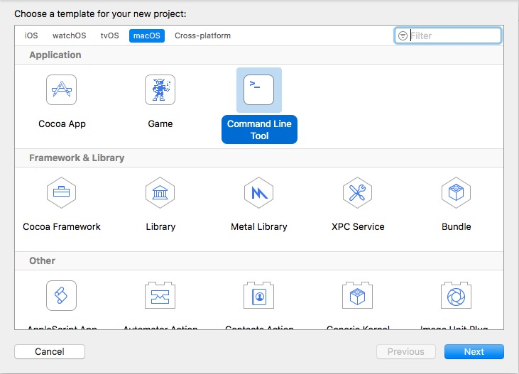
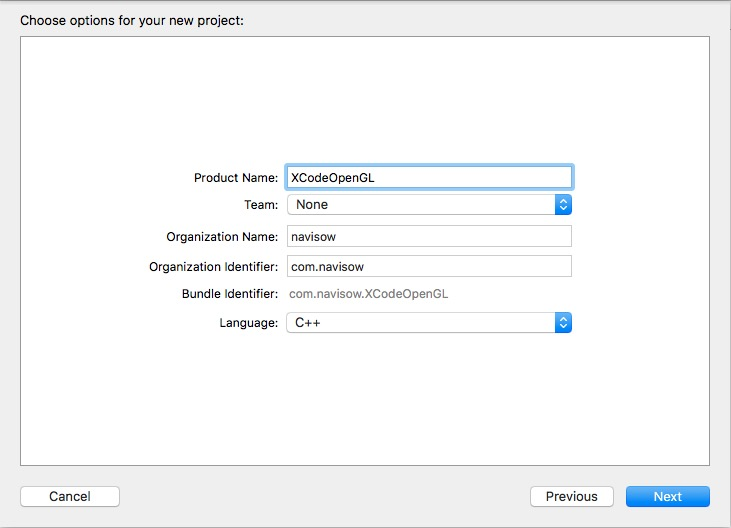
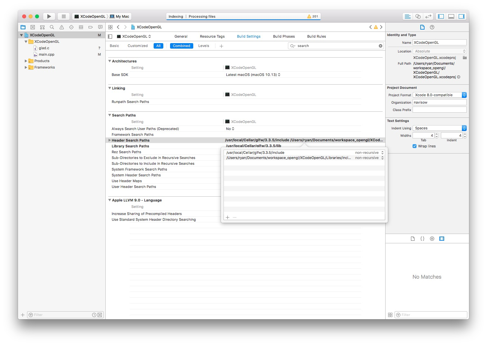
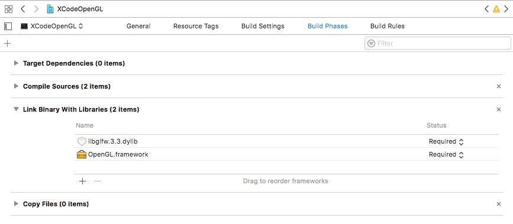
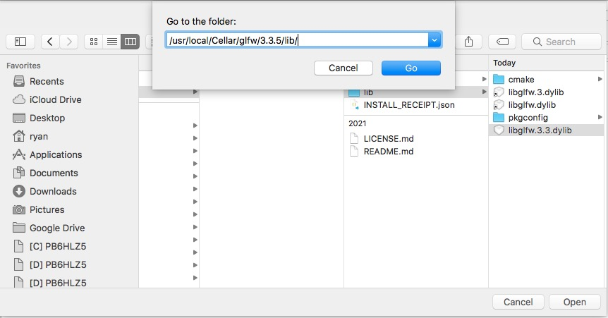
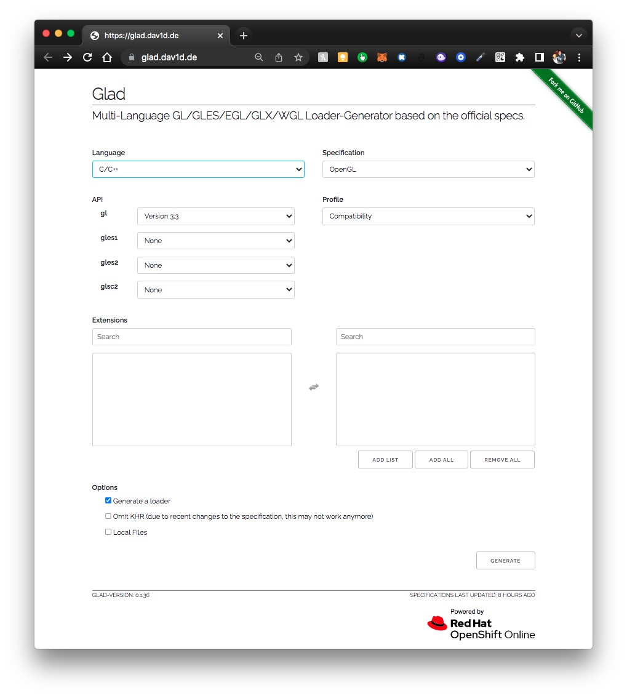
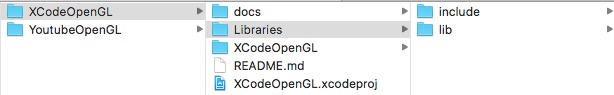
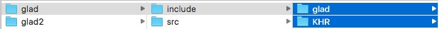
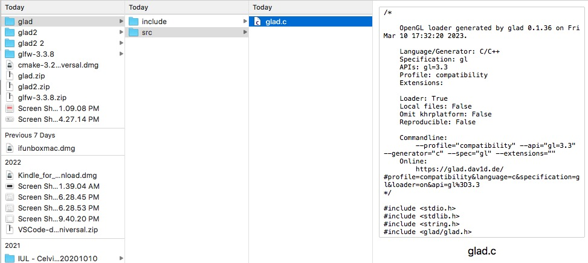
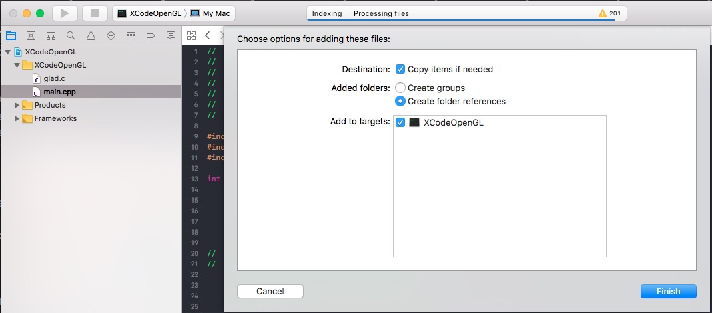

# XCodeOpenGL
Learn OpenGL on XCode.

## References
* [Hello World Tutorial](https://youtu.be/MHlbNbWlrIM)
* [FreeCodeCamp Tutorial](https://youtu.be/45MIykWJ-C4)

* [GLFW](https://www.glfw.org/)
* [GLFW github repo](https://github.com/glfw/glfw)

* [glad - gl loader](https://glad.dav1d.de/)
* [glad github repo](https://github.com/Dav1dde/glad)

## Setup
### 1. Open XCode and create a new project
* macOS > Command Line Tool
  
* Select language C++
  

### 2. Install the **GLFW** using `homebrew`.
```bash
$ brew install glfw
==> cmake -DGLFW_USE_CHDIR=TRUE -DGLFW_USE_MENUBAR=TRUE -DBUILD_SHARED_LIBS=TRUE .
==> make install
🍺  /usr/local/Cellar/glfw/3.3.5: 14 files, 431.5KB, built in 39 seconds
```

### 3. Add **GLFW** header files to the project include path.
Go to project *Build Settings* tab, search for "header search", *double-click* on **Header Search Paths**. Add "/usr/local/Cellar/glfw/3.3.5/include".


### 4. Add the *libs*.
Go to project *Build Phase* tab > Link Binary With Libraries


1. Add **OpenGL.framework**.
2. Add *glfw lib* by clicking the `Add Other...` button. Go to `/usr/local/Cellar/glfw/3.3.5/lib/` path. Select the *lib* binary.
   
   
   ## Hello World window.
   Go to [GLFW Documentation](https://www.glfw.org/documentation.html) and copy the *Hello World* code. Put it in `Main.cpp`:
   ```cpp
   #include <GLFW/glfw3.h>
   
   int main(void)
   {
       GLFWwindow* window;
       
       /* Initialize the library */
       if (!glfwInit())
           return -1;
       
       /* Create a windowed mode window and its OpenGL context */
       window = glfwCreateWindow(640, 480, "Hello World", NULL, NULL);
       if (!window)
       {
           glfwTerminate();
           return -1;
       }
       
       /* Make the window's context current */
       glfwMakeContextCurrent(window);
       
       /* Loop until the user closes the window */
       while (!glfwWindowShouldClose(window))
       {
           /* Render here */
           glClear(GL_COLOR_BUFFER_BIT);
           
           /* Swap front and back buffers */
           glfwSwapBuffers(window);
           
           /* Poll for and process events */
           glfwPollEvents();
       }
       
       glfwTerminate();
       return 0;
   }
   ```

Run the build with `⌘B`.

## Add **glad**, a GL loader.
### 1. Go to [glad](https://glad.dav1d.de/), select the options below and generate the loader:
* gl: *Version 3.3*
* profile: *Compatibility*



Download the package, then extract it.

### 2. Create `Libraries` folder in the project folder. Then create `include` folder and `lib` folder inside it:


### 3. Copy all contents in glad *include* folder, and put them in the `XCodeOpenGL/Libraries/include` folder.


### 4. Copy the `glad.c` in the glad *src* folder, and drop it in the project:



Write the code that calls `gladLoadGL()`, then run the build with `⌘B`.
